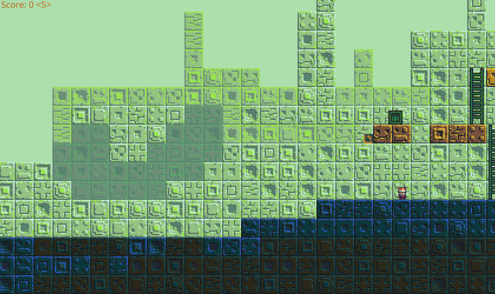

# pltfrmr in python
A simple platformer game in python arcade and pymunk.

Features:
- mostly arcade lib, patterns used in game dev.
- pixel , simple control
- physics based gameplay with pymunk
- maps created in 
- can record and replay movement (to/from file or on the fly)

TODOs:
- more and more pyglet, less n less arcade
- soundeffects, maybe music
- jetpack, box-throwing, etc. capabilities
- rpg like stats but then it needs more levels
- proper controller support
- shaders